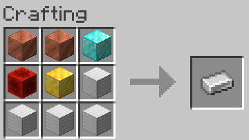
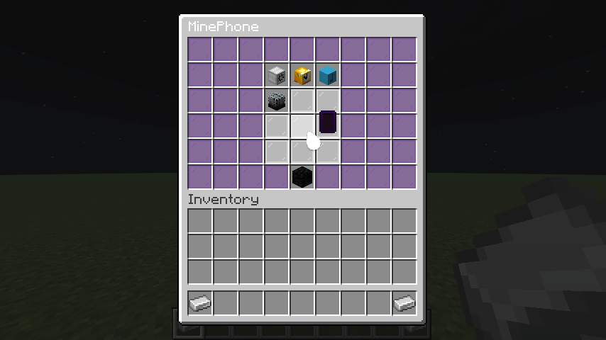

# MinePhone
Fully featured, all-in-one Minecraft phone plugin. To get a phone, you must craft one using the following recipe:

Here's a gif of the plugin being used:

## Features
- Per-phone customisation options
- Portable personal music player
- View the current world time and moon phase

## Apps
- Settings
- Music
- Time
- Phone

## Dependencies
MinePhone depends on the following plugin:
- [CraftLib](https://www.spigotmc.org/resources/craftlib.79163/)

## License
OQL
